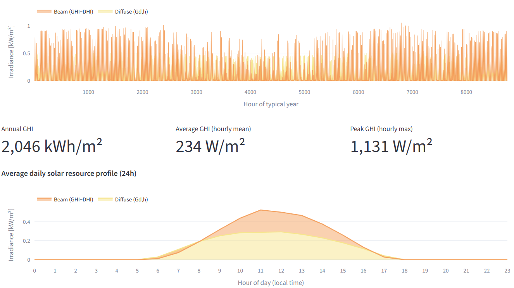
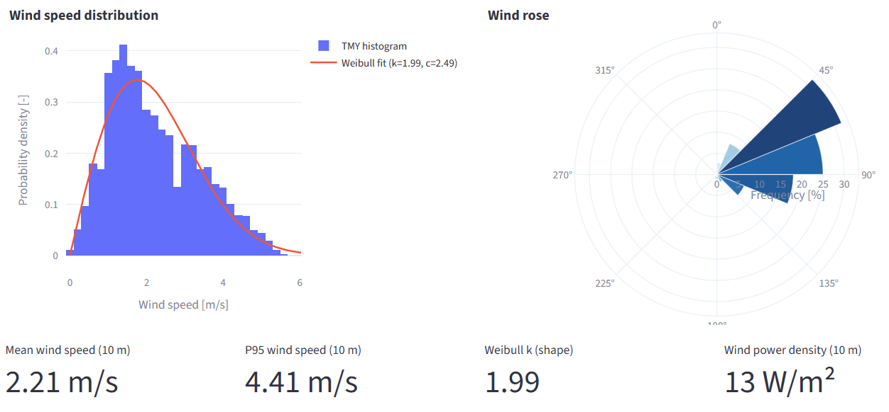

# PVGIS Resource Assessment Tool (Solar PV & Wind)

This repository provides a **Streamlit-based application** for **solar photovoltaic (PV)** and **wind turbine** resource assessment using **PVGIS Typical Meteorological Year (TMY)** data.  
The tool is designed to support **energy system modelling, pre-feasibility studies, and educational use**, offering transparent assumptions, interactive visualization, and exportable hourly results.

## Overview

The application allows you to:

- Select any geographic location worldwide
- Download **hourly Typical Meteorological Year (TMY)** climate data from **PVGIS**
- Analyse **solar irradiance** and **wind resource** characteristics
- Simulate **hourly electricity production** for:
  - Solar PV systems
  - Wind turbines (from a built-in turbine library or user-defined power curves)
- Visualize results through intuitive plots
- Export all relevant data as CSV files for further modelling

## Data Source: PVGIS TMY

The tool relies on the **Photovoltaic Geographical Information System (PVGIS)** developed by the **European Commission – Joint Research Centre (JRC)**:

👉 https://joint-research-centre.ec.europa.eu/photovoltaic-geographical-information-system-pvgis_en

For a selected location, the app downloads a **Typical Meteorological Year (TMY)** dataset, which:

- Is built from multiple decades of historical weather data
- Represents a statistically “typical” year
- Is widely used in energy system modelling to estimate **long-term average performance**
- Avoids the need to simulate many individual weather years

The fetched TMY includes (when available):
- Global and diffuse solar irradiance (hourly)
- Wind speed and direction at 10 m
- Ambient temperature and other meteorological variables

## Workflow

The application follows a clear, step-by-step workflow:

### 1) Location & Time Zone
- Input latitude and longitude manually or select them interactively on a map
- Define the local **UTC offset** to shift hourly profiles into local time
- Download the PVGIS TMY dataset (hourly resolution)

A preview of the downloaded TMY data is shown for transparency.

---

### 2) Solar PV Assessment

#### Solar Resource Analysis
Before simulating PV production, the tool visualizes the **solar resource itself**:
- Stacked area plots of **beam** and **diffuse** irradiance
- Average daily solar resource profile (24 hours)
- Key indicators:
  - Annual Global Horizontal Irradiance (GHI)
  - Average and peak irradiance values

These plots help understand *how much solar energy is available* and *when it occurs*.

<p align="center">
  
</p>

#### PV System Inputs
Users define:
- Nominal PV capacity (kWp)
- Tilt and azimuth angles
- Ground albedo
- Temperature-related parameters (NMOT, temperature coefficient, etc.)

Default values are provided and can be kept for standard assessments.

#### PV Performance Outputs
Results include:
- Annual energy production (kWh)
- Specific yield (kWh/kWp)
- Approximate capacity factor
- Average daily PV profile with variability band (min–max across days)
- Monthly PV yield (bar chart)

---

### 3) Wind Resource & Turbine Assessment

#### Wind Resource Analysis
The wind resource is analysed independently of the turbine:
- Wind speed distribution and Weibull fit
- Wind rose (directional frequency and intensity)
- Key indicators:
  - Mean and P95 wind speed
  - Weibull shape parameter
  - Wind power density at 10 m

This separates **resource quality** from **technology performance**.

<p align="center">
  
</p>

#### Turbine Selection
Two options are available:
- **Built-in turbine library**  
  Includes predefined turbines with:
  - Hub height
  - Rotor diameter
  - Rated power
  - Drivetrain efficiency
  - Power curve (CSV)
- **Custom turbine upload**  
  Users can upload their own power curve (CSV or Excel) with:
  - Wind speed [m/s]
  - Power output [kW]

Library turbines automatically populate default parameters, which can still be overridden.

#### Wind Performance Model
The model:
- Extrapolates wind speed from 10 m to hub height using a power-law profile
- Applies the selected power curve and drivetrain efficiency
- Computes hourly turbine power output

#### Wind Performance Outputs
Results include:
- Annual energy production (kWh)
- Yield per kW rated
- Approximate capacity factor
- Average daily turbine output (local time)
- Monthly wind energy yield (bar chart)

## Visualizations

The app provides:
- Stacked area plots (solar resource)
- Line plots with variability bands (daily profiles)
- Weibull distributions and wind roses
- Monthly bar charts for PV and wind production
- Interactive maps for location selection

All plots are designed to be **interpretable and educational**, not black-box outputs.

## Exported Outputs

The **Export** page allows downloading a ZIP file containing:
- Raw PVGIS TMY data (hourly)
- Hourly PV production
- Hourly wind turbine production
- Full internal result tables (for traceability)

All outputs are provided as **CSV files**, ready for:
- Energy system optimisation models
- Further statistical analysis
- Teaching and reporting

---

## Notes

- Results are based on **typical-year data**, not extreme or interannual variability
- Capacity factors are indicative, not guarantees
- For bankable studies, site-specific measurements and multi-year analysis are required

---

# **Installation**

### **Conda (recommended)**

```bash
conda env create -f environment.yml
conda activate pvgis_streamlit

```

### **Running**

```bash
streamlit run app.py
```

Then open:

```
http://localhost:8501
```

---

# **Contact**

**Alessandro Onori**  
📧 alessandro.onori@polimi.it

Technical Advisors  
- Riccardo Mereu — Politecnico di Milano  
- Emanuela Colombo — Politecnico di Milano

---

# **License**

European Union Public Licence (EUPL v1.1).
